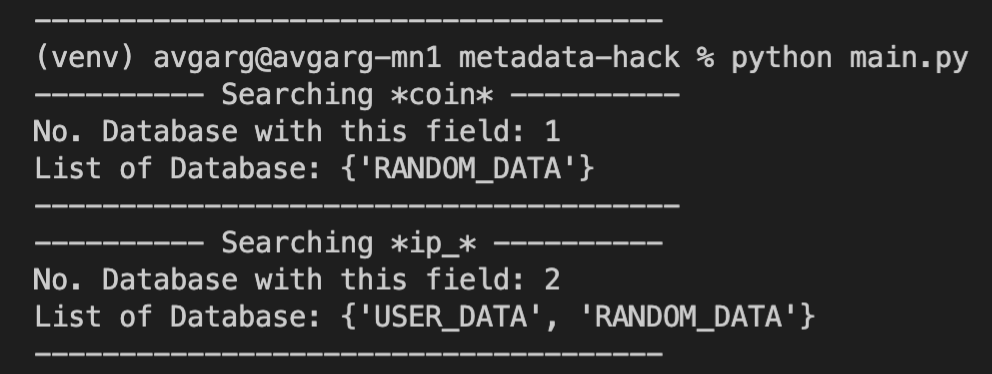

<p align="center">
  <h3 align="center">Metadata Day 2022</h3>
  <p align="center">
    Regex based field search on database fields ✨
    </br>
    <a href="https://github.com/avisionx/metadata-day-2022/#table-of-contents"><strong>Explore the Docs »</strong></a>
  </p>
</p>

<!-- TABLE OF CONTENTS -->

## Table of Contents

- [About the Project](#about-the-project)
  - [Built With](#built-with)
- [Getting Started](#getting-started)
  - [Prerequisites](#prerequisites)
  - [Installation](#installation)
- [Roadmap](#roadmap)
- [Contributing](#contributing)
- [License](#license)
- [Contact](#contact)

<!-- ABOUT THE PROJECT -->

## About The Project
Datahub currently doesn't have a feature to allow one to search for databases based on fields. We propose a regex based field search powered by elasticsearch (this can be also done using lucene) on fields for better management and tracking of it. 

Here's why:
- Allow old data to be reused for new applications - Since one would first search for relevant fields before recreating another dataset
- Save Money - As datasets will be reused we'll reduce the cost significantly
- Improve performance - As the number of datasets will decrease in the system it would allow datastores to perform better
- Tracking sensitive and legal data - One would be able to search for a sensitive field across all datasets and figure out all at once

Example:
Let's say we're looking for \*ip_\*. Then it will return any tables (USER_DATA, RANDOM_DATA) that we store and match the pattern.
<p align="center">
    
</p>

### Built With

This project uses [elasticsearch](https://www.elastic.co/) and the api interface can be created in python, the project gives a proof of concept on how the api can be setup where the field_regex can be passed in param. Tools / technologies used:
- [python](https://www.python.org/)
- [elasticsearch python](https://elasticsearch-py.readthedocs.io/en/7.x/)

<!-- GETTING STARTED -->

## Getting Started

To get up and running with this project on your local machine follow these simple steps.

### Prerequisites

Here's a list of things you'll need to use have prior to installing the software.

- elasticsearch
```
# Refer: https://www.elastic.co/guide/en/elasticsearch/reference/current/install-elasticsearch.html
```

### Installation

1. Clone the repo

```sh
git clone https://github.com/avisionx/metadata-day-2022.git
```

2. Create virtualenv & activate it

```sh
python3 -m venv venv
source venv/bin/activate
```

3. Install dependencies

```sh
pip install -r requirements.txt
```

4. Run python script to run example searches

```sh
python main.py
```

<!-- ROADMAP -->

## Roadmap
The tool can be extended...
- point 1
- point 2

<!-- LICENSE -->

## License

Distributed under the MIT License. See `LICENSE` for more information.

<!-- CONTACT -->

## Contact

Avi Garg - [https://avisionx.net/](https://avisionx.net/) - hello@avisionx.net
Debashish Ghosh - 
Rishika Gupta - 

Project Link: [https://github.com/avisionx/metadata-day-2022](https://github.com/avisionx/metadata-day-2022)
